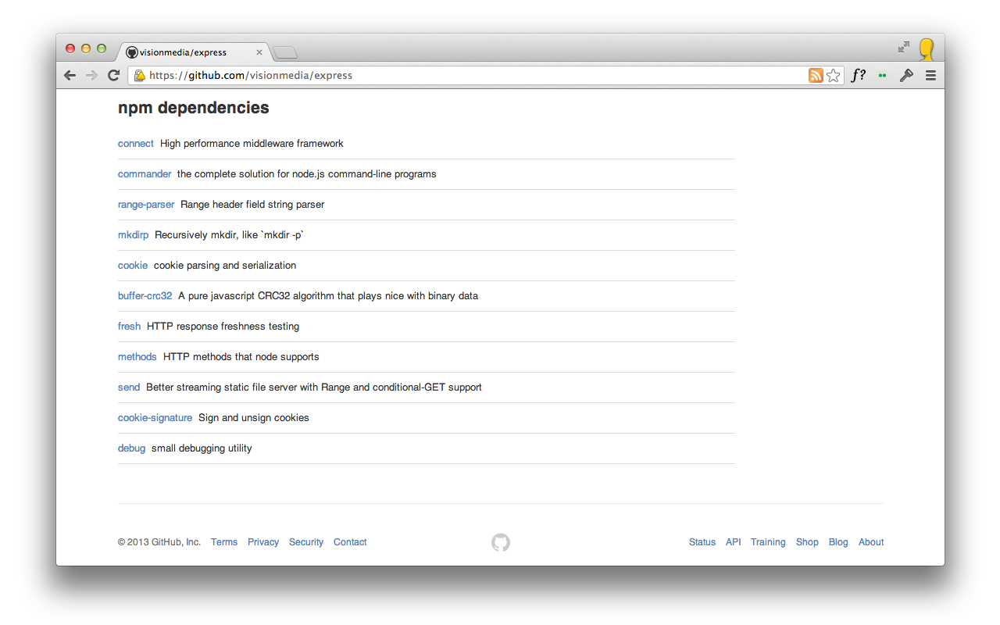

# npmhub

[link-cws]: https://chrome.google.com/webstore/detail/npmhub/kbbbjimdjbjclaebffknlabpogocablj 'Version published on Chrome Web Store'
[link-amo]: https://addons.mozilla.org/en-US/firefox/addon/npm-hub/ 'Version published on Mozilla Add-ons'

npmhub is a browser extension that lets you explore npm dependencies on GitHub repos. When viewing a repository's file list containing a `package.json`, this extension will display links and descriptions for each dependency at the bottom of the page.

GitHub Enterprise is also supported by right-clicking on <a href="https://user-images.githubusercontent.com/1402241/32874388-e0c64150-cacc-11e7-9a50-eae3727fd3c2.png" target="_blank">npmhub's icon in the toolbar</a> and selecting <strong>Enable npmhub on this domain</strong>.

## Installation

- [**Chrome** extension][link-cws] [][link-cws]
- [**Firefox** add-on][link-amo] [][link-amo]

The Chrome version also works in Opera (using [this](https://addons.opera.com/en/extensions/details/download-chrome-extension-9/)) and Edge.

## Design

Here's what npmhub looks like:

## See Also

- [packagehub](https://github.com/BrainMaestro/packagehub) - an extension for displaying dependencies for different package managers on GitHub.
- [ghub.io](http://ghub.io) - jump straight to the GitHub repo of an npm package, e.g. [ghub.io/express](http://ghub.io/express).
