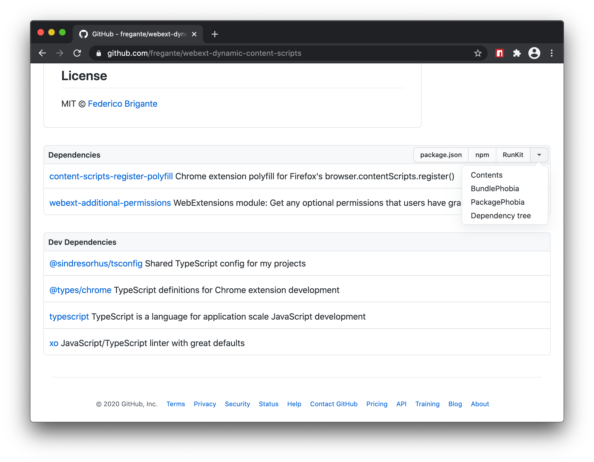

#  npmhub

<!-- HTML tags used so the description can be copy-pasted onto Mozilla Addons -->

On every GitHub repository or folder with a <code>package.json</code> file, scroll to the bottom of the page to see a list of its npm dependencies and their descriptions.

npmhub also adds convenient links to:

<ul>
	<li>the <b>package.json</b> file
	<li><b>npmjs.com</b>
	<li><b>RunKit</b> to test the package
	<li><b>BundlePhobia</b> to see the package size when bundled
	<li><b>PackagePhobia</b> to see the package size when installed
	<li><b>NPMGraph</b> to explore the sub-dependencies
	<li><b>UNPKG</b> to see the exact contents published to npm
</ul>

GitHub Enterprise is also supported, see the [guide](https://fregante.github.io/webext-permission-toggle/?name=npmhub&icon=https%3A%2F%2Fraw.githubusercontent.com%2Fnpmhub%2Fnpmhub%2Fmain%2Fassets%2Ficon.svg).

## Installation

[link-chrome]: https://chrome.google.com/webstore/detail/npmhub/kbbbjimdjbjclaebffknlabpogocablj 'Version published on Chrome Web Store'
[link-firefox]: https://addons.mozilla.org/en-US/firefox/addon/npm-hub/ 'Version published on Mozilla Add-ons'
[link-safari]: https://apps.apple.com/app/npmhub/id1542090429 'Version published on the Mac App Store'

[][link-chrome] [][link-chrome] and other Chromium browsers

[][link-firefox] [][link-firefox] including Firefox Android

[][link-safari] [][link-safari] on Mac, iOS and iPadOS

 _If you love npmhub, consider [sponsoring or hiring](https://github.com/sponsors/fregante) the maintainer [@fregante](https://twitter.com/fregante)_

## Design

Here's what npmhub looks like:

## See Also

- [GhostText](https://github.com/fregante/GhostText) - An extension to use your text editor to write in your browser. Everything you type in the editor will be instantly updated in the browser (and vice versa).
- [packagehub](https://github.com/BrainMaestro/packagehub) - An extension for displaying dependencies for different package managers on GitHub.
- [ghub.io](http://ghub.io) - A URL shortener to jump straight to the GitHub repo of an npm package, e.g. [ghub.io/express](http://ghub.io/express).
